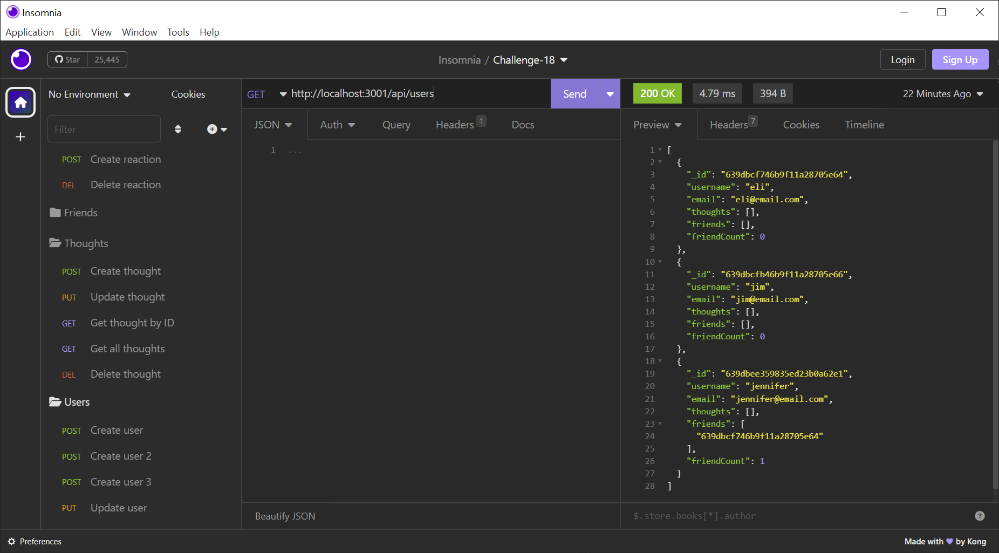

# NoSQL Social Network API

## Description

I was tasked with creating an API for a social network where users can share their thoughts, add friends, and react to friends' thoughts. I used Express.js, MongoDB, and Mongoose to create the API. 

## Video Link
[Video Link](https://drive.google.com/file/d/1Hwy-CQs-De7ZvJzWpGKhbAuxZ0S1dKIA/view)

## Screenshot

